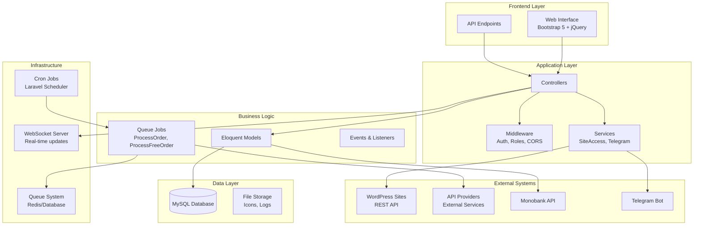
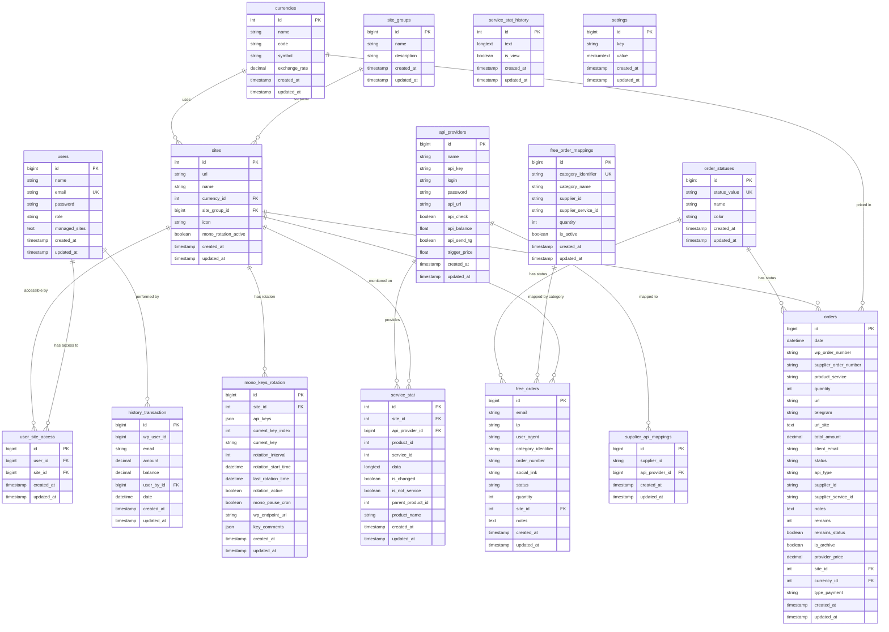
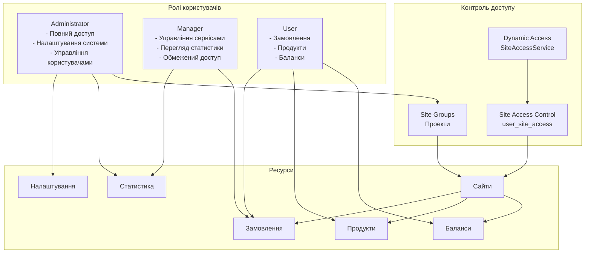
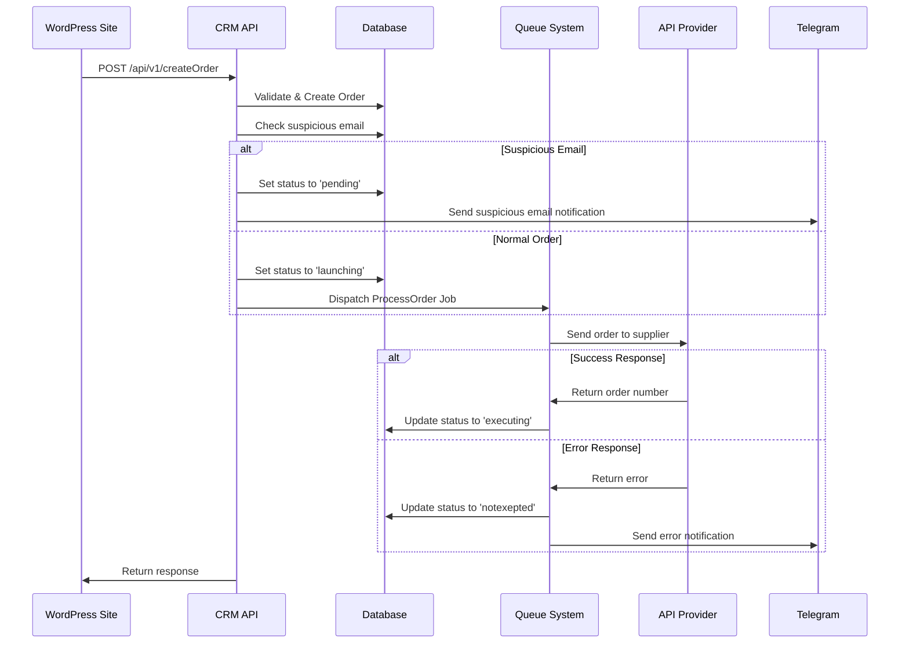
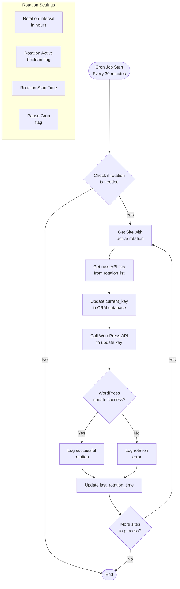
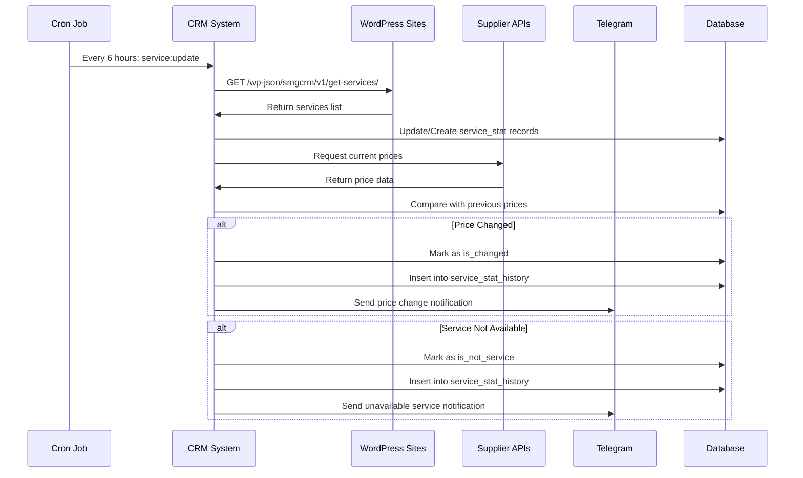

# 📋 SMG CRM - Документація проекту

## 🎯 Загальний опис

**SMG CRM** - це повнофункціональна система управління взаємовідносинами з клієнтами, спеціально розроблена для автоматизації процесів інтернет-магазинів. Система інтегрується з WordPress сайтами та забезпечує автоматичне управління замовленнями, балансами користувачів, моніторингом цін та сервісів постачальників.

---

## 🏗️ Архітектура системи



---

## 🗄️ Схема бази даних



---

## 👥 Система ролей та доступу



---

## 🌐 Структура сторінок та маршрутизація

```mermaid
graph TB
    subgraph "Публічні маршрути"
        Login[/ - Login Page]
    end
    
    subgraph "Авторизовані користувачі"
        OrdersPage[/order - Управління замовленнями]
        FreeOrders[/free-orders - Безкоштовні замовлення]
        Products[/products - Продукти]
        Balance[/balance - Гаманці]
        UserSettings[/user/settings - Налаштування користувача]
        Transactions[/transactions - Транзакції]
    end
    
    subgraph "Менеджери + Адміністратори"
        ServiceStat[/service-stat - Моніторинг сервісів]
        ServiceHistory[/service-stat-history - Історія змін]
    end
    
    subgraph "Тільки адміністратори"
        Statistics[/statistics - Статистика]
        GeneralSettings[/settings/general - Загальні налаштування]
        ApiProviders[/settings/apies - API постачальники]
        OrderStatuses[/settings/order-statuses - Статуси замовлень]
        Currencies[/settings/currencies - Валюти]
        Sites[/settings/sites - Сайти]
        SiteGroups[/settings/site-groups - Проекти]
        Users[/users/list - Користувачі]
        SupplierMapping[/settings/supplier - Співставлення API]
        FreeOrderSettings[/settings/free-orders - Налаштування безкоштовних замовлень]
    end
    
    Login --> OrdersPage
    OrdersPage --> FreeOrders
    OrdersPage --> Products
    OrdersPage --> Balance
    OrdersPage --> UserSettings
    OrdersPage --> Transactions
    OrdersPage --> ServiceStat
    ServiceStat --> ServiceHistory
    OrdersPage --> Statistics
    Statistics --> GeneralSettings
    GeneralSettings --> ApiProviders
    GeneralSettings --> OrderStatuses
    GeneralSettings --> Currencies
    GeneralSettings --> Sites
    GeneralSettings --> SiteGroups
    GeneralSettings --> Users
    GeneralSettings --> SupplierMapping
    GeneralSettings --> FreeOrderSettings
```

---

## 🔄 Потік обробки замовлень



---

## 🔧 Автоматизовані процеси

```mermaid
gantt
    title Cron Jobs Schedule
    dateFormat HH:mm
    axisFormat %H:%M
    
    section Every 2 minutes
    Process Orders     :active, proc1, 00:00, 00:02
    Check Waiting Status :active, wait1, 00:00, 00:02
    Check Notexcepted   :active, note1, 00:00, 00:02
    
    section Every 10 minutes
    Check API Balance   :active, bal1, 00:00, 00:10
    
    section Every 30 minutes
    Rotate Mono Keys    :active, mono1, 00:00, 00:30
    
    section Every Hour
    Update Currencies   :active, curr1, 00:00, 01:00
    
    section Every 6 hours
    Update Services     :active, serv1, 00:00, 06:00
```



---

## 📡 API інтеграції

```mermaid
graph LR
    subgraph "SMG CRM"
        CRM[CRM System]
    end
    
    subgraph "WordPress Sites"
        WP1[Site 1<br/>WordPress]
        WP2[Site 2<br/>WordPress]
        WP3[Site N<br/>WordPress]
    end
    
    subgraph "External APIs"
        Supplier1[Supplier API 1]
        Supplier2[Supplier API 2]
        Mono[Monobank API]
        TG[Telegram API]
    end
    
    subgraph "WordPress API Endpoints"
        GetServices[/wp-json/smgcrm/v1/get-services/]
        GetProducts[/wp-json/smgcrm/v1/get-products]
        GetBalance[/wp-json/smgcrm/v1/get-user-balance/]
        SetBalance[/wp-json/smgcrm/v1/set-user-balance/]
        UpdateMono[/wp-json/smgcrm/v1/update-mono-api-key]
    end
    
    subgraph "CRM API Endpoints"
        CreateOrder[/api/v1/createOrder]
        MonoGetKey[/api/v1/mono/get-api-key]
        MonoUpdateKey[/api/v1/mono/update-api-key]
        CreateFreeOrder[/api/v1/free-orders/create]
    end
    
    CRM <--> WP1
    CRM <--> WP2
    CRM <--> WP3
    CRM --> Supplier1
    CRM --> Supplier2
    CRM <--> Mono
    CRM --> TG
    
    WP1 --> GetServices
    WP1 --> GetProducts
    WP1 --> GetBalance
    WP1 --> SetBalance
    WP1 --> UpdateMono
    
    CRM --> CreateOrder
    CRM --> MonoGetKey
    CRM --> MonoUpdateKey
    CRM --> CreateFreeOrder
```

---

## 🔄 Система ротації Monobank ключів



---

## 📊 Моніторинг сервісів та цін



---

## 🎯 Ключові особливості системи

### 1. **Багатосайтова архітектура**
- Централізоване управління множиною WordPress сайтів
- Роздільні доступи користувачів до різних сайтів
- Групування сайтів у проекти для зручного управління

### 2. **Автоматизація замовлень**
- Автоматичне створення замовлень через API
- Асинхронна обробка через систему черг Laravel
- Автоматичні сповіщення в Telegram про статуси

### 3. **Моніторинг цін та сервісів**
- Автоматичне відстеження змін цін у постачальників
- Сповіщення про недоступні сервіси
- Історія всіх змін з можливістю перегляду

### 4. **Система безкоштовних замовлень**
- Окрема система для обробки безкоштовних послуг
- Контроль лімітів за IP та email
- Мапінг категорій на конкретні сервіси

### 5. **Інтеграція з Monobank**
- Автоматична ротація API ключів
- Синхронізація з WordPress сайтами
- Логування всіх операцій

### 6. **Real-time оновлення**
- WebSocket з'єднання для миттєвих оновлень
- Pusher інтеграція для real-time сповіщень

---

## 🛠️ Технічний стек

### **Backend**
- **Framework:** Laravel 10.x
- **PHP:** 8.1+
- **Database:** MySQL/MariaDB
- **Queue:** Redis/Database driver
- **WebSockets:** Laravel WebSockets + Pusher

### **Frontend**
- **CSS Framework:** Bootstrap 5.3.2
- **JavaScript:** jQuery + Axios
- **Build Tool:** Vite
- **Icons:** Bootstrap Icons + Font Awesome

### **DevOps & Infrastructure**
- **Task Scheduling:** Laravel Cron
- **Process Management:** Supervisor (for queues)
- **Logging:** Laravel Log (Monolog)
- **Caching:** Redis/File cache

### **External Integrations**
- **Payment Processing:** Monobank API
- **Notifications:** Telegram Bot API
- **CMS Integration:** WordPress REST API
- **Service Providers:** Various Supplier APIs

---

## 📈 Можливості для розширення

### **Короткострокові покращення**
1. **Dashboard аналітики** - розширена статистика з графіками
2. **API документація** - автоматична генерація документації
3. **Експорт звітів** - PDF/Excel звіти
4. **Мобільна версія** - адаптивний дизайн для мобільних пристроїв

### **Довгострокові можливості**
1. **Multi-tenancy** - повна ізоляція даних між клієнтами
2. **Machine Learning** - прогнозування попиту та оптимізація цін
3. **Microservices** - розділення на окремі сервіси
4. **Advanced Analytics** - Business Intelligence інструменти

---

## 📋 Використання документації

Ця документація містить Mermaid діаграми, які можна візуалізувати за допомогою:

1. **GitHub/GitLab** - автоматичний рендеринг Mermaid діаграм
2. **Mermaid Live Editor** - https://mermaid.live/
3. **VS Code** - з плагіном Mermaid Preview
4. **Notion, Obsidian** - підтримують Mermaid діаграми
5. **Draw.io** - можна імпортувати Mermaid код

Для кращого розуміння архітектури рекомендується переглянути всі діаграми в інтерактивному режимі. 